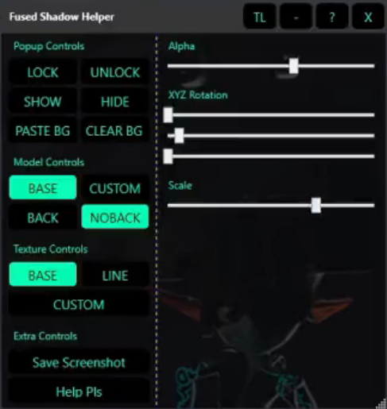

# Midna Helmet   Helper WPF

*Tool to streamline the imp ass drawing*  
*process, while avoiding fused shadows.*

 
 

[![Button Trailer]][Trailer]   
[![Button Download]][Download]

[![Button Workflow]][Workflow]   
[![Button Controls]][Controls]

 
 

 

 
 

## Todo

 

-   Applying custom textures will always align to  
    the upper left coordinates, haven't figured out  
    how to get around this yet.

 

-   Figure out a non-shit way to control model  
    position for people with smaller screens.

 

<!----------------------------------------------------------------------------->

[Download]: https://github.com/NotBoogie/MidnaHelmetHelperWPF/releases
[Trailer]: https://twitter.com/i/status/1450492184965181441

[Controls]: Documentation/Controls.md
[Workflow]: Documentation/Workflow.md

<!---------------------------------[ Buttons ]--------------------------------->

[Button Workflow]: https://img.shields.io/badge/Workflow-4479A1?style=for-the-badge&logoColor=white&logo=MLflow
[Button Controls]: https://img.shields.io/badge/Controls-00B388?style=for-the-badge&logoColor=white&logo=AppleArcade
[Button Download]: https://img.shields.io/badge/Download-0194E2?style=for-the-badge&logoColor=white&logo=DocuSign
[Button Trailer]: https://img.shields.io/badge/Trailer-B5314C?style=for-the-badge&logoColor=white&logo=YouTube
